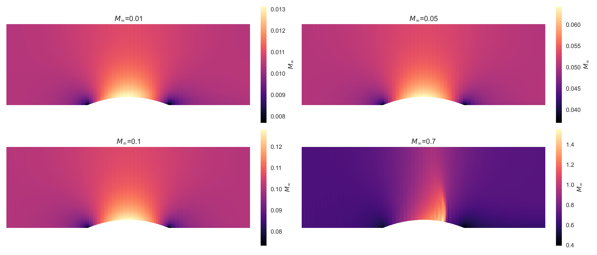
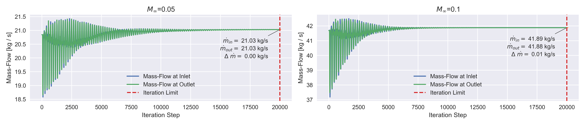

# Internal Channel Flow Simulation using Finite Volume Methods
_A compact Finite Volume Method solver for 2D Euler equations (internal channel flow). Demonstrates numerical methods, scientific programming and shock capturing._  


## Overview
This project implements a finite volume solver for the 2D Euler equations to simulate compressible internal channel flow over a symmetric bump. The complete workflow, from discretization, numerical flux computation, dissipation modeling, time integration, boundary conditions, to validation, follows the methodology described in Hirsch, Vol. 2.

- Central differencing scheme with numerical dissipation (after Hirsch, Numerical Computation of Internal & External Flows, Vol. 2)
- Low-storage Runge-Kutta (4th order) time integration
- Both **subsonic** and **supersonic** flow regimes are analyzed

This solver includes basic parallelization via Numba and is specifically tailored to internal channel flow. It is not intended as a general-purpose CFD package, rather, it serves as a compact academic-style example demonstrating the implementation of finite volume methods.

## Example: Shock Formation on Channel Bump
Simulation output for a freestream Mach number of $M_{\infty} = 0.7$, showing the solver’s ability to capture the formation of a shock over the bump.

<figure align="center">
  
  <figcaption style="margin-bottom: 1em;"><b>Figure 1:</b> Shock formation at Mach 0.7.</figcaption>
</figure> 


## Quickstart
Clone and install:
``` 
git clone https://github.com/<your-username>/fvm-channel-flow.git
cd fvm-channel-flow
pip install -e .
```

Run sample cases:
```
python main.py --config examples/config.yaml
```

Results (plots) will be stored in the ``examples`` directory.


## Governing Equations
The solver implements the 2D Euler equations in conservative form:

$$
\begin{equation*}
	\frac{\partial U}{\partial t} + \nabla \cdot F = \frac{\partial U}{\partial t} + \frac{\partial f}{\partial x} + \frac{\partial g}{\partial y} = 0
\end{equation*}
$$

with U being the vector of conserved variables and f, g being the flux tensor in x- and y-direction:

$$
\begin{equation*} 
	U =\begin{bmatrix}
		\rho \\
		\rho u \\
		\rho v \\
		\rho E \\
	\end{bmatrix}, \quad
	f =\begin{bmatrix}
		\rho u \\
		\rho u^2 + p\\
		\rho u v\\
		\rho u H \\
	\end{bmatrix}, \quad
	g =\begin{bmatrix}
		\rho v \\
		\rho u v \\
		\rho v^2 + p \\
		\rho v H \\
	\end{bmatrix} \quad
\end{equation*}
$$

**Thermodynamics:**
- Pressure: $p = (\gamma-1)\left(\rho E - \tfrac{1}{2}\rho(u^2+v^2)\right)$
- Total energy: $E = e + \tfrac{1}{2}(u^2+v^2)$, with $e = p /((\gamma-1)\rho)$
- Total enthalpy: $H = E + p/\rho$

Variables:
- $\rho$ : density  
- $u, v$ : velocity components  
- $p$ : pressure  
- $E$ : total specific energy  
- $H$ : total enthalpy  
- $c = \sqrt{\gamma R T}$ : speed of sound  


## Finite Volume Formulation
### Formulation
The finite volume formulation without source terms in semi-discrete form is given by:
$$
\begin{equation*}
	\frac{d}{dt} \int_{\Omega} U\ dV + \int_{\partial \Omega}\ F\ d\textbf{S} = 0
\end{equation*}
$$

The discretization across faces is then given by:

$$
\begin{equation*}
	\frac{d}{dt} \left \lbrack U_{ij}\ \Omega_{ij} \right \rbrack + \sum_{faces} \textbf{F*} \cdot \Delta \textbf{S} = 0 
\end{equation*}
$$

### Numerical Fluxes
The numerical fluxes across cell faces are computed using a central differencing scheme with artificial dissipation terms:

$$
\begin{align*}
& (\mathbf{F*} \mathbf{\Delta S})\_{i+1,j} & = & \left \lbrack \frac{1}{2} \left (\mathbf{F}\_{i,j} + \mathbf{F}\_{i+1,j} \right ) \right \rbrack \cdot \mathbf{\Delta S} - D\_{i+1,j} \\ 
& (\mathbf{F*} \mathbf{\Delta S})\_{i-1,j} & = & \left \lbrack \frac{1}{2} \left (\mathbf{F}\_{i-1,j} + \mathbf{F}\_{i,j} \right ) \right \rbrack \cdot \mathbf{\Delta S} + D_{i-1,j} \\
& (\mathbf{F*} \mathbf{\Delta S})\_{i,j+1} & = &\left \lbrack \frac{1}{2} \left (\mathbf{F}\_{i,j} + \mathbf{F}\_{i,j+1} \right ) \right \rbrack \cdot \mathbf{\Delta S} - D_{i,j+1} \\
& (\mathbf{F*} \mathbf{\Delta S})\_{i,j-1} & = & \left \lbrack \frac{1}{2} \left (\mathbf{F}\_{i,j-1} + \mathbf{F}\_{i,j} \right ) \right \rbrack \cdot \mathbf{\Delta S} + D\_{i,j-1}
\end{align*}
$$


### Artificial Dissipation (after Hirsch)
As proposed by Hirsch the following formulation of artifical dissipation was implemented:

$$
D_{\hat{i},\hat{j}} = \eta_{\hat{i},\hat{j}}(U_R-U_L) + \gamma_{\hat{i},\hat{j}}(U_R-U_L)
$$

with

$$
\eta_{\hat{i},\hat{j}} = \tfrac{1}{2}\kappa^{(2)} \Big(|\mathbf{v}\cdot \Delta S| + c |\Delta S|\Big)\cdot \max(v_{ij}, v_{\hat{i},\hat{j}})
$$

$$
\gamma_{\hat{i},\hat{j}} = \max\left(0, \tfrac{1}{2}\kappa^{(2)} \Big(|\mathbf{v}\cdot \Delta S| + c|\Delta S|\Big) - \eta_{\hat{i},\hat{j}}\right)
$$

Pressure sensor:

$$
v_{ij} = \left| \frac{p_{\hat{i}+ ,\hat{j}+} - 2p_{ij} + p_{\hat{i}- ,\hat{j}-}}{p_{\hat{i}+ ,\hat{j}+} + 2p_{ij} + p_{\hat{i}- ,\hat{j}-}} \right|
$$

Hat indices $(\hat{i}, \hat{j})$: denote cell faces, e.g.
- East: $(i+1/2,j)$,  West: $(i-1/2,j)$  
- North: $(i,j+1/2)$, South: $(i,j-1/2)$

### Time Discretization
Low-storage Runge-Kutta (4th order):

$$
\begin{align*}
	Y_1 &= U_{ij}^n \\
	Y_2 &= U_{ij}^n - \frac{\Delta t}{\Omega_{ij}}\ \alpha_2\ R_{ij}(Y_1) \\
	Y_3 &= U_{ij}^n - \frac{\Delta t}{\Omega_{ij}}\ \alpha_3\ R_{ij}(Y_2) \\
	Y_4 &= U_{ij}^n - \frac{\Delta t}{\Omega_{ij}}\ \alpha_4\ R_{ij}(Y_3) \\
	U_{ij}^{n+1} &= U_{ij}^n - \frac{\Delta t}{\Omega_{ij}}\ R_{ij}(Y_4) 
\end{align*}
$$

Timestep (CFL condition):

$$
\Delta t_{ij} = \frac{CFL}{\tfrac{u_{max,ij}}{\Delta x_{ij}} + \tfrac{v_{max,ij}}{\Delta y_{ij}}}
$$


## Boundary Conditions
Boundary conditions are enforced using ghost cells to impose the correct physical behavior at the domain boundaries.

### Inlet (Stagnation Conditions)
At the inlet, stagnation conditions are prescribed from the freestream Mach number $M_{\infty}$, atmospheric pressure $p_{atm}$, and temperature $T_{atm}$.  

The stagnation state is computed using isentropic relations:

$$
p_s = p_{atm}\left(1+\tfrac{\gamma-1}{2}M_{\infty}^2\right)^{\tfrac{\gamma}{\gamma-1}}, 
\quad T_s = T_{atm}\left(1+\tfrac{\gamma-1}{2}M_{\infty}^2\right).
$$

From this, the static inlet values are obtained as:

$$
p_{inlet} = \frac{p_s}{\left(1+\tfrac{\gamma-1}{2}M_{inlet}^2\right)^{\tfrac{\gamma}{\gamma-1}}},
\quad T_{inlet} = \frac{T_s}{\left(1+\tfrac{\gamma-1}{2}M_{inlet}^2\right)}.
$$

Density follows from the ideal gas law $\rho = p/(RT)$, and velocity from the Mach relation $u = M_{inlet}\cdot c_{inlet}$, with $v=0$ and $c=\sqrt{\gamma \cdot R \cdot T}$.


### Outlet (Fixed Pressure)
At the outlet, density and velocity are extrapolated from the interior, while a fixed static pressure condition is imposed:
$$
p = p_{atm}.
$$
The total energy $E$ is recomputed accordingly to maintain consistency.


### Top and Bottom Walls (Slip Condition)
Along solid walls, a slip condition is enforced to prevent penetration. The velocity is projected onto the wall tangent using:

$$
\mathbf{\hat{v}} = \mathbf{v} - (\mathbf{v}\cdot \mathbf{n})\mathbf{n},
$$

where $\mathbf{n}$ is the face-normal vector.  
The total energy is then updated by combining the unchanged internal energy with the corrected kinetic energy.


## Validation
To validate the solver, the results have been compared with those presented in **Hirsch (Fig. 11.5.10)**.  For this comparison, the bump height coefficient was set to $\epsilon = 0.4$, and cases with $M_{\infty} \in \{0.01, 0.05, 0.1, 0.7\}$ were simulated.  

Overall, the solver reproduces the reference trends:  
- For $M_{\infty} = 0.01, 0.1, 0.7$, the local Mach number distributions agree well with literature.  
- For $M_{\infty} = 0.7$, the shock induced by the bump is clearly captured at the expected location.  
- A discrepancy appears at $M_{\infty} = 0.05$, where our simulation predicts a slightly higher Mach range than the reference.  

<figure align="center">
  
  <figcaption style="margin-bottom: 1em;"><b>Figure 2:</b> Local Mach number distribution for different M<sub>&infin;</sub> compared against reference literature.</figcaption>
</figure> <br/><br/>

To investigate the discrepancy at $M_{\infty} = 0.05$, the inlet and outlet mass flow rates have been analyzed. Both converge to consistent steady-state values, confirming that the solution is physically consistent. For $M_{\infty} = 0.1$, the mass flow converges to $41.9\ \text{kg/s}$, closely matching the reference value of $41.6\ \text{kg/s}$.  

<figure align="center">
  
  <figcaption style="margin-bottom: 1em;"><b>Figure 3:</b> Inlet and outlet mass flow convergence for Freestream at M<sub>&infin;</sub> = 0.05 and M<sub>&infin;</sub> = 0.1.</figcaption>
</figure> <br/><br/>

In summary, the solver reproduces the reference results with good accuracy, including correct shock formation in the supersonic case. Minor deviations may arise from differences in the dissipation model, but the overall agreement confirms the validity of the implementation.


## References
- Hirsch, C. *Numerical Computation of Internal and External Flows*, Vol. 2 — numerical dissipation, discretization schemes, boundary conditions, and full solver workflow.
